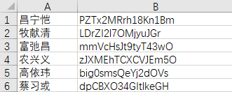

# 深挖简历

## 1.介绍实习项目

### 1. 项目背景

车载总线通信数据库开发工具-VDE
**官方概述**
车载总线通信是汽车电子控制系统交互的桥梁，目前主流的车载通信平台为多网段多总线类型的混合式架构，总线类型涉及CAN(FD)/LIN/Ethernet总线通信数据库设计和管理对车型开发至关重要。
INTEWORK-VDE(Vehicle Database Editor)Cloud是一款基于B/S架构的车载总线通信数据库设计和管理系统。支持多人同时在线使用，可以提高研发效率;覆盖CAN(FD)/LIN/Ethernet在内的多种总线类型通信数据库设计，支持车型和平台级别的数据管理与版本控制;保证数据安全，可与EEA开发工具、AUTOSAR配置工具进行数据交互实现上下游衔接。

- **项目名称**：VDE（Vehicle Database Editor）（AUTOSAR）车载总线通信数据库开发工具
  - **项目目的**：~~因为近年来新能源汽车的需求量增加，各个厂商研发新车的周期变短，所以需要能有高效的工具，为整车通信网络设计过程提效率；之前很多厂商都是使用德国引进的软件CANoe，但是由于维护成本高学习成本高等原因，想要找到一款国产替代。我们公司从2002年成立以来一直在汽车行业深耕，所以有能力去做这样工具的开发。~~
    因为近年来汽车厂商新车迭代的速度越来越快，需要有工具为整车设计工作提效。我们的工具是用在汽车整车设计过程中的，用户是汽车通信模块的设计师。包括数据存储和编辑两大功能，分为**系统信号、网络拓扑、报文打包、操作日志**等7个模块，可以支持多人同时在线使用，支持多种车载通信协议，可以进行数据管理和版本控制。
  - **项目规模**：我所在的团队有19个人
  - **项目周期**：在一年的时间内完成这个项目，分三期来交付
  - **包括哪些模块**
    按照需求文档的划分，一共有8个模块：
    **网络拓扑**：整个项目的结构，下拉选择框选择不同的网段，侧边栏展示网段下车型和电子控制单元
    **系统信号**：可以导入、新建、编辑、删除数据，起到数据库的作用
    **报文打包**：将多个信号打包到报文中一起发送，在此模块配置由哪个电子控制单元来发送信号，不同的电子控制单元能够发送和接收的对象不同
    **TP配置**：给报文配置收发节点
    **平台管理**：不同平台的数据分离，有新建、复制、导入的功能
    **车型管理**：平台数据的子集，可以从别的车型继承也可以导入
    **操作日志**：系统出问题了可以通过操作日志定位，误删数据可以回溯
    **系统设置**：一些默认值的设置等（比如信号的排布默认可以设置**MSBFirst高位在前**、**LSB First低位在前)**
  ### 2. 个人角色
  - **职责**：我在项目中参与质量控制工作，角色是测试工程师
  - **团队组成**：团队前端后端测试比例大约为1：5：1.5
  ### 3. 工作内容
  - **测试策略**：测试主要采用黑盒测试和灰盒测试
  - **测试环境**：描述测试环境的搭建，使用的测试工具和平台。
  - **测试用例**：到第二期交付时，测试用例大概有2600条，覆盖95%以上的功能
  - **执行测试**：第二期交付，一轮测试bug率为9%左右，经过三轮的测试，交付时bug率降低到1%以下，留了一些优化项到第三期
  - **缺陷管理**：缺陷管理用的是禅道和公司自己开发的系统，外网用Excel、内网用SVN和一个自己开发的系统来管理测试用例
  - **测试报告**：介绍你如何编写测试报告，以及如何向项目管理层汇报测试结果。
  ### 4. 技术栈
  - **测试工具**：JMeter
  - **自动化框架**：如果你参与了自动化测试，可以详细介绍你使用的自动化框架。
  - **CI/CD**：如果有持续集成/持续部署的实践，也可以提及。
  ### 5. 成果与影响
  - **项目成果**：现在已经交付70%，用户在试用阶段；预计在9月份全部交付；
  - **个人贡献**：
    - 我在项目中参与每一次的冒烟测试；负责网络拓扑和报文打包模块、操作日志模块的功能测试；负责过一个测试周期的稳定性测试；也参与了一部分性能测试的工作
    - 编写过300条左右的测试用例，都是针对操作日志模块的，用例评审通过率大于95%；
  - **经验教训**：
    - 了解的从开发到上线的流程
    - 实际运用了测试理论，例如测试用例的设计方法（**等价类划分、边界值分析、 因果图法、决策表测试、状态迁移测试、错误猜测法、组合测试**）
      假设登录接口要求用户名为6到12个字符，密码为8到16个字符：
      - 使用等价类划分，可以将用户名和密码分别划分为三个等价类。
      - 使用边界值分析，测试用户名为5、6、12、13个字符；密码为7、8、16、17个字符。
      - 使用决策表测试，考虑用户名和密码的有效性组合，例如用户名有效+密码有效、用户名有效+密码无效等。
    - 了解了软件质量六要素对应了哪些测试
      - **功能性**：通过功能测试、回归测试等方法确保软件满足所有功能需求。
      - **可靠性**：使用压力测试、故障注入测试等技术来评估软件在异常条件下的表现。
      - **可用性**：采用用户体验测试、可用性测试等手段来衡量用户与软件交互的顺畅程度。
      - **效率**：进行性能测试、负载测试等来测量软件的响应时间和资源消耗。
      - **可维护性**：审查代码质量、文档完整性和版本控制流程等来评估软件的可维护性。
      - **可移植性**：测试软件在不同操作系统、硬件平台上的兼容性和移植性。
  ### 6. 结论
  - **总结学到的经验**：
    - 了解的从开发到上线的流程
    - 实际运用了测试理论，例如测试用例的设计方法（**等价类划分、边界值分析、 因果图法、决策表测试、状态迁移测试、错误猜测法、组合测试**）
      假设登录接口要求用户名为6到12个字符，密码为8到16个字符：
      - 使用等价类划分，可以将用户名和密码分别划分为三个等价类。
      - 使用边界值分析，测试用户名为5、6、12、13个字符；密码为7、8、16、17个字符。
      - 使用决策表测试，考虑用户名和密码的有效性组合，例如用户名有效+密码有效、用户名有效+密码无效等。
    - 了解了软件质量六要素对应了哪些测试
      - **功能性**：通过功能测试、回归测试等方法确保软件满足所有功能需求。
      - **可靠性**：使用压力测试、故障注入测试等技术来评估软件在异常条件下的表现。
      - **可用性**：采用用户体验测试、可用性测试等手段来衡量用户与软件交互的顺畅程度。
      - **效率**：进行性能测试、负载测试等来测量软件的响应时间和资源消耗。
      - **可维护性**：审查代码质量、文档完整性和版本控制流程等来评估软件的可维护性。
      - **可移植性**：测试软件在不同操作系统、硬件平台上的兼容性和移植性。
  - 未来想要继续提升自动化测试相关的工具和手段，想尝试云测的手段
  - **感想**：希望能去一个更大的平台，继续提升自己的能力和思维方式


## 2.性能测试是怎么做的

先把需要测试的接口梳理出来，比如用户登录、不同类型文件的导入和导出、平台复制、缓存速度等

### **以用户登录举例**

从50个用户开始，每次增加30个用户，逐渐增加到200个，最大就是200个；

如果是C/S 架构的应用，要考虑实际用户并发量，可以进行阶梯式测试，分阶段加线程；

本地创建文件，保存为 csv 格式，里面保存用户名和密码。



**CSV Data Set Config** 选择本地创建好的文件，设置变量名。

（后续在需要传参的请求中，引用变量 ${username},${password}）


## 以导入文件举例

#### 1. 创建测试计划

- 新建测试计划
- 添加一个线程组

#### 2.配置HTTP请求

- 线程组添加HTTP请求
- 设置Method为Post
- 文件路径
- 设置Content-Type为`multipart/form-data`

#### 3.配置监听器

需要关注的指标（通过配置监听器Lister来输出这些指标

- 平均响应时间
- 中位数
- 最大值
- 最小值
- **90th Percentile Response Time**：90%的响应时间小于这个值
- 95
- 99


#### 4. 执行测试


## 3.性能测试报告内容

目的

地点

环境

服务器、客户端环境

测试工具

规模及限制

测试过程说明

模型

案例

场景

测试结果

性能测试总结


## 4.压测的时候看服务器的哪些指标？

进行压测的时候，使用以下命令查看服务器的情况：

top -p ：CPU使用情况，磁盘的IO（影响系统响应时间和整体性能）

free -m ：内存使用率

iostat -x 1  5： 每1秒输出5次磁盘的io统计


## 5.稳定性测试测什么

可以分为三个阶段：恒定压力、峰值测试、引入异常干扰

恒定压力阶段；如果是波动的压力，出现吞吐量波动或者响应延迟的长尾现象会难以捕捉分析，难以区分是业务的问题还是服务的问题，为性能问题定位带来较大难度。

基于一定的产品压力模型的已上线产品（根据实际压力峰值测试，比如早上8点用户高峰期）；

第三阶段，恒定压力下，引入异常干扰，注入异常用例


## 6.实习遇到最印象深刻的Bug

- 一个偶发问题，偶发弹出没有系统操作权限弹窗，几秒后消失；偶发问题没有反应过来要截图就自己好了
  - 遇到时，按照刚刚的操作再试几次，看看是否还会再发生
  - 和开发人员沟通，描述偶发问题，出现的场景
  - web端可以用一些测试录屏插件，Jams，可以录屏同时记录鼠标键盘的操作，帮助测试人员复现偶发时的场景
  - 最后排查觉得最可能是性能瓶颈造成的，多人同时在线导致服务器资源紧张
  - 如果暂时无法解决，要和团队一起评估缺陷的严重程度；
  - 体现在测试报告中（写明偶发bug的硬件环境、操作系统、浏览器版本、偶发的功能模块）；


## 项目：小说精品屋项目/美客生鲜

### 性能测试工具选择考虑因素

1. 专业、稳定、高效，比如 LoadRunner, 工业级性能负载工具。
2. 简单易上手，在测试脚本上不用花太多时间。
3. 有技术支持，文档完善，不用在疑难问题上花费时间，集中精力在性能分析上。
4. 要考虑投入产出比，比如我们可以选择免费开源的 JMeter。当然有时候自研或者使用开源不一定比商业工具更省钱，因为要做技术上的投资，时间上的投资。

### jenkins使用中遇到的问题

部署后代码没有改变

描述：最新push的代码删除了某个类的引用，但是看程序日志输出发现删除的类还在

原因：因为jenkins之配置了正常打包命令，整个程序的打包命令只会向前打包，也就是有新的类或者依赖会加进来，但是不会把没有的删除掉；

解决：加一个clean参数

```sql
mvn clean install -Dmaven.test.skip=true
```


## 用户并发数怎么测

- **线程数**：设置线程组中的线程数，即并发用户数。
- **启动时间**：设置线程的启动时间，可以逐步增加并发用户数，模拟真实的用户增长过程。


## TPS在哪测

在JMeter中

- 创建测试计划
- 添加HTTP请求
  - 设置URL
  - 请求方法、参数、路径
- 添加监听器
  - 添加Listenner
  - view Result tree 查看结果数
  - aggregate report 聚合报告
- 配置用户并发数
- 运行测试


## CPU利用率

- 反应系统负载
- 反应资源分配，看哪些进程或者线程占用最多的CPU时间
- 性能瓶颈，CPU利用率接近100%，说明已经到了极限，考虑优化代码或者硬件

## 内存利用率

- 资源消耗，高内存利用率可能导致系统频繁进行页面交换，影响性能

- 发现内存泄露，即长时间占用内存无法释放的情况

- 利用率接近/超过系统总内存，可能导致系统变慢或者崩溃

  

## IO这些指标意义？

- 反应系统与外部设备的数据交互情况，高IO操作可能意味着大量的数据读写操作，影响系统性能
- 磁盘IO操作频率和速度直接影响到系统的响应时间和吞吐量；达到瓶颈考虑存储方案优化
- 网络延迟网络的IO操作延迟和带宽使用情况对分布式系统影响大；考虑网络配置优化


## 接口间参数传递的一种解决方案


JMeter 工具为例，它就提供了通过后置处理器的多种参数提取方法。

其解决方案是，通过正则、JSON Extracor 等提取的结果作为变量，动态传递数值给下游（变量）使用。


#  课题项目：蛋白质信息在线数据库

## 中间件有哪些？

### 数据库中间件

MYSQL proxy：用于负载均衡、故障转移、查询缓存

### 消息中间件

1. RocketMQ：RocketMQ是阿里开源的消息中间件，主要应用于金融、电商等领域。等

### 缓存中间件

redis：一个开源的内存数据结构存储，用于缓存，消息代理、试试数据分析和排名
